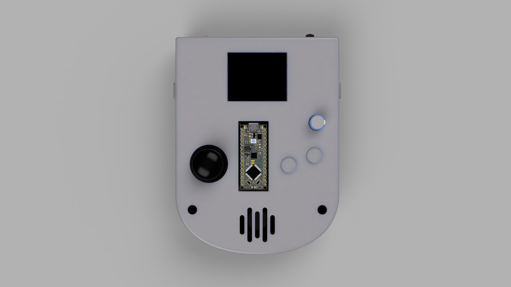
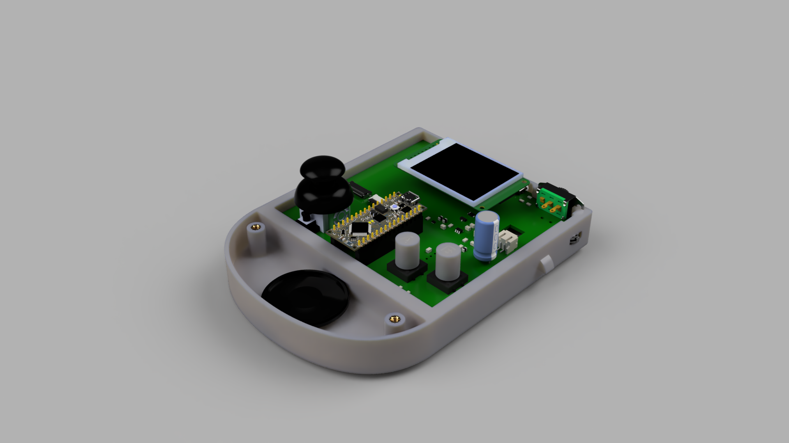

# arduboy-2.0
Arduino Nano PCB Project, replicates an Arduboy with a 1.8" TFT Display, Joystick, two Push Buttons, a Speaker, and a Lipo Battery with Integrated Charging Circuit.

  
  

This repository includes:
- CAD: The associated Fusion 360 Project Archive, Autodesk Inventor Export, STEP, and PNG render files.
- PCB: The associated CircuitMaker/Altium Project Package file. 
- Software: The associated platform.io project to develop and program the arduino nano that powers the device.

